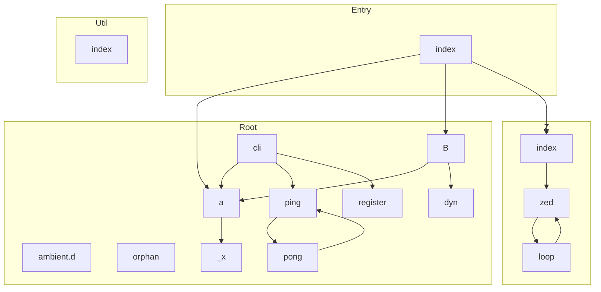

<!-- repo-map:no-verification -->
<!-- GENERATED FILE -- do not edit by hand.
     Regenerate with `npm run docs:deps`. -->

# mini-repo - Dependency Graph

**Version**: 1.0.0 | **Last Updated**: <DATE>

This document provides a comprehensive dependency graph of all files, components, imports, functions, and variables in the codebase.

---

## Table of Contents

1. [Overview](#overview)
2. [Package Dependencies](#package-dependencies)
3. [Root Dependencies](#root-dependencies)
4. [Entry Dependencies](#entry-dependencies)
5. [Util Dependencies](#util-dependencies)
6. [Z Dependencies](#z-dependencies)
7. [Dependency Matrix](#dependency-matrix)
8. [Circular Dependency Analysis](#circular-dependency-analysis)
9. [Visual Dependency Graph](#visual-dependency-graph)
10. [Summary Statistics](#summary-statistics)

---

## Overview

The codebase is organized into the following modules:

- **root**: 10 files
- **entry**: 1 file
- **util**: 1 file
- **Z**: 3 files

---

## Root Dependencies

### `src/a.ts` - Lower-case name: sorts after `B.ts` in code-unit order.

**Internal Dependencies:**
| File | Imports | Type |
|------|---------|------|
| `./_x.js` | `helper` | Import |

**Exports:**
- Interfaces: `AlphaOptions`
- Functions: `alpha`
- Constants: `unusedConstant`

---

### `src/ambient.d.ts` - ambient.d module

---

### `src/B.ts` - Upper-case name: sorts before `a.ts` in code-unit order.

**Internal Dependencies:**
| File | Imports | Type |
|------|---------|------|
| `./a.js` | `AlphaOptions` | Import (type-only) |
| `./dyn.js` | `` | Import (type-only) |

**Exports:**
- Classes: `Bravo`

---

### `src/cli.ts` - cli module

**Internal Dependencies:**
| File | Imports | Type |
|------|---------|------|
| `./a.js` | `alpha` | Import |
| `./ping.js` | `ping` | Import |
| `./register.js` | `` | Import |

---

### `src/dyn.ts` - dyn module

**Exports:**
- Constants: `dynamicValue`

---

### `src/orphan.ts` - orphan module

**Exports:**
- Functions: `forgotten`

---

### `src/ping.ts` - ping module

**Internal Dependencies:**
| File | Imports | Type |
|------|---------|------|
| `./pong.js` | `pong` | Import |

**Exports:**
- Functions: `ping`

---

### `src/pong.ts` - pong module

**Internal Dependencies:**
| File | Imports | Type |
|------|---------|------|
| `./ping.js` | `ping` | Import |

**Exports:**
- Functions: `pong`

---

### `src/register.ts` - register module

---

### `src/_x.ts` - _x module

**Exports:**
- Functions: `helper`

---

## Entry Dependencies

### `src/index.ts` - Public entry of the fixture package.

**Internal Dependencies:**
| File | Imports | Type |
|------|---------|------|
| `./a.js` | `` | Re-export |
| `./B.js` | `` | Re-export |
| `./Z/index.js` | `` | Re-export |
| `./view.js` | `` | Re-export |
| `./Z/index.js` | `*` | Re-export |
| `./a.js` | `alpha, AlphaOptions` | Re-export |
| `./B.js` | `Bravo` | Re-export |
| `./view.js` | `render` | Re-export |

**Exports:**
- Re-exports: `* from ./Z/index.js`, `alpha`, `AlphaOptions`, `Bravo`, `render`

---

## Util Dependencies

### `src/util/index.ts` - Entry point exporting 1 symbols

**Exports:**
- Functions: `clamp`

---

## Z Dependencies

### `src/Z/index.ts` - Package entry point for Z (re-exports 2 symbols)

**Internal Dependencies:**
| File | Imports | Type |
|------|---------|------|
| `./zed.js` | `` | Re-export |
| `./zed.js` | `zed, ZedShape` | Re-export |

**Exports:**
- Re-exports: `zed`, `ZedShape`

---

### `src/Z/loop.ts` - Type definitions (1 interfaces, 0 type aliases)

**Internal Dependencies:**
| File | Imports | Type |
|------|---------|------|
| `./zed.js` | `ZedShape` | Import (type-only) |

**Exports:**
- Interfaces: `Loop`

---

### `src/Z/zed.ts` - zed module

**Internal Dependencies:**
| File | Imports | Type |
|------|---------|------|
| `./loop.js` | `Loop` | Import (type-only) |

**Exports:**
- Interfaces: `ZedShape`
- Functions: `zed`

---

## Dependency Matrix

### File Import/Export Matrix

| File | Imports From | Exports To |
|------|--------------|------------|
| `src/a` | 1 file | 3 files |
| `src/index` | 4 files | 0 files |
| `src/B` | 2 files | 1 file |
| `src/cli` | 3 files | 0 files |
| `src/ping` | 1 file | 2 files |
| `src/Z/zed` | 1 file | 2 files |
| `src/pong` | 1 file | 1 file |
| `src/Z/index` | 1 file | 1 file |
| `src/Z/loop` | 1 file | 1 file |
| `src/dyn` | 0 files | 1 file |
| `src/register` | 0 files | 1 file |
| `src/_x` | 0 files | 1 file |
| `src/ambient.d` | 0 files | 0 files |
| `src/orphan` | 0 files | 0 files |
| `src/util/index` | 0 files | 0 files |

---

## Circular Dependency Analysis

**2 circular dependencies detected:**

- **Runtime cycles**: 1 (require attention)
- **Type-only cycles**: 1 (safe, no runtime impact)

### Runtime Circular Dependencies

These cycles involve runtime imports and may cause issues:

- src/ping.ts -> src/pong.ts -> src/ping.ts

### Type-Only Circular Dependencies

These cycles only involve type imports and are safe (erased at runtime):

- src/Z/zed.ts -> src/Z/loop.ts -> src/Z/zed.ts

---

## Visual Dependency Graph

---

## Summary Statistics

| Category | Count |
|----------|-------|
| Total TypeScript Files | 15 |
| Total Modules | 4 |
| Total Lines of Code | 101 |
| Total Exports | 16 |
| Total Re-exports | 7 |
| Total Classes | 1 |
| Total Interfaces | 3 |
| Total Functions | 7 |
| Total Type Guards | 0 |
| Total Enums | 0 |
| Type-only Imports | 4 |
| Runtime Circular Deps | 1 |
| Type-only Circular Deps | 1 |

---

*Last Updated*: <DATE>
*Version*: 1.0.0
