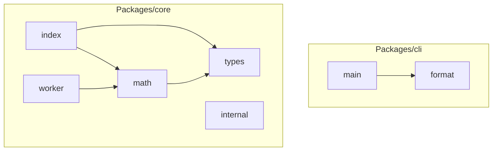

<!-- repo-map:no-verification -->
<!-- GENERATED FILE -- do not edit by hand.
     Regenerate with `repo-tools map`. -->

# mono-repo - Dependency Graph

**Version**: unknown

This document provides a comprehensive dependency graph of all files, components, imports, functions, and variables in the codebase.

---

## Table of Contents

1. [Overview](#overview)
2. [Package Dependencies](#package-dependencies)
3. [Packages/cli Dependencies](#packages-cli-dependencies)
4. [Packages/core Dependencies](#packages-core-dependencies)
5. [Dependency Matrix](#dependency-matrix)
6. [Circular Dependency Analysis](#circular-dependency-analysis)
7. [Visual Dependency Graph](#visual-dependency-graph)
8. [Summary Statistics](#summary-statistics)

---

## Overview

The codebase is organized into the following modules:

- **packages/cli**: 2 files
- **packages/core**: 5 files

---

## Packages/cli Dependencies

### `packages/cli/src/format.ts` - format module

**Exports:**
- Functions: `format`

---

### `packages/cli/src/main.ts` - main module

**Workspace Dependencies:**
| Package | Import |
|---------|--------|
| `@scope/core` | `add` |

**Internal Dependencies:**
| File | Imports | Type |
|------|---------|------|
| `./format.js` | `format` | Import |

---

## Packages/core Dependencies

### `packages/core/src/index.ts` - Package entry point for @scope/core (re-exports 2 symbols)

**Internal Dependencies:**
| File | Imports | Type |
|------|---------|------|
| `./math.js` | `add` | Re-export |
| `./types.js` | `Pair` | Re-export (type-only) |

**Exports:**
- Re-exports: `add`, `Pair`

---

### `packages/core/src/internal.ts` - internal module

**Exports:**
- Constants: `INTERNAL_FLAG`

---

### `packages/core/src/math.ts` - math module

**Internal Dependencies:**
| File | Imports | Type |
|------|---------|------|
| `./types.js` | `Pair` | Import (type-only) |

**Exports:**
- Functions: `add`, `double`

---

### `packages/core/src/types.ts` - Type definitions (0 interfaces, 1 type aliases)

**Exports:**
- Types: `Pair`

---

### `packages/core/src/worker.ts` - worker module

**Internal Dependencies:**
| File | Imports | Type |
|------|---------|------|
| `./math.js` | `double` | Import |

**Exports:**
- Constants: `workerResult`

---

## Dependency Matrix

### File Import/Export Matrix

| File | Imports From | Exports To |
|------|--------------|------------|
| `packages/core/src/math` | 1 file | 2 files |
| `packages/core/src/index` | 2 files | 0 files |
| `packages/core/src/types` | 0 files | 2 files |
| `packages/cli/src/format` | 0 files | 1 file |
| `packages/cli/src/main` | 1 file | 0 files |
| `packages/core/src/worker` | 1 file | 0 files |
| `packages/core/src/internal` | 0 files | 0 files |

---

## Circular Dependency Analysis

**No circular dependencies detected.**
---

## Visual Dependency Graph

---

## Summary Statistics

| Category | Count |
|----------|-------|
| Total Source Files | 9 |
| Subsystems | 2 |
| Total Lines of Code | 40 |
| Total Exports | 8 |
| Total Re-exports | 2 |
| Total Classes | 0 |
| Total Interfaces | 0 |
| Total Functions | 3 |
| Total Type Guards | 0 |
| Total Enums | 0 |
| Type-only Imports | 2 |
| Runtime Cyclic Components | 0 |
| Type-only Cyclic Components | 0 |
| Files in Runtime Cycles | 0 |
| Files in Type-only Cycles | 0 |

---

*Version*: unknown
